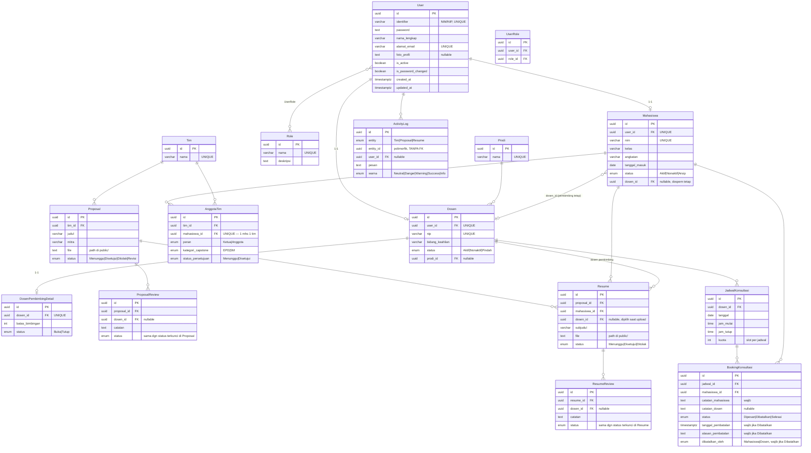

# ERD — Capstone Project App

---

## Tabel (detail constraint)

### Auth & Role

**User**
| Field | Tipe | Constraint | On Delete |
|---|---|---|---|
| id | UUID | PK | — |
| identifier | VARCHAR | UNIQUE, NOT NULL (NIM/NIP) | — |
| password | TEXT | NOT NULL | — |
| nama_lengkap | VARCHAR | NOT NULL | — |
| alamat_email | VARCHAR | UNIQUE, NOT NULL | — |
| foto_profil | TEXT | NULLABLE | — |
| is_active | BOOLEAN | NOT NULL, DEFAULT true | — |
| is_password_changed | BOOLEAN | NOT NULL, DEFAULT false | — |
| created_at | TIMESTAMPTZ | NOT NULL | — |
| updated_at | TIMESTAMPTZ | NOT NULL | — |

**Role**
| Field | Tipe | Constraint | On Delete |
|---|---|---|---|
| id | UUID | PK | — |
| nama | VARCHAR | UNIQUE, NOT NULL | — |
| deskripsi | TEXT | NOT NULL | — |
| created_at | TIMESTAMPTZ | NOT NULL | — |
| updated_at | TIMESTAMPTZ | NOT NULL | — |

**UserRole** (junction User ↔ Role)
| Field | Tipe | Constraint | On Delete |
|---|---|---|---|
| id | UUID | PK | — |
| user_id | UUID | FK → User.id, UNIQUE composite dgn role_id, NOT NULL | CASCADE |
| role_id | UUID | FK → Role.id, UNIQUE composite dgn user_id, NOT NULL | CASCADE |
| created_at | TIMESTAMPTZ | NOT NULL | — |
| updated_at | TIMESTAMPTZ | NOT NULL | — |

### Master Data

**Prodi**
| Field | Tipe | Constraint | On Delete |
|---|---|---|---|
| id | UUID | PK | — |
| nama | VARCHAR | UNIQUE, NOT NULL | — |
| created_at | TIMESTAMPTZ | NOT NULL | — |
| updated_at | TIMESTAMPTZ | NOT NULL | — |

**Mahasiswa**
| Field | Tipe | Constraint | On Delete |
|---|---|---|---|
| id | UUID | PK | — |
| user_id | UUID | FK → User.id, UNIQUE (1–1), NOT NULL | CASCADE |
| nim | VARCHAR | UNIQUE, NOT NULL | — |
| kelas | VARCHAR | NOT NULL | — |
| angkatan | VARCHAR | NOT NULL | — |
| tanggal_masuk | DATE | NOT NULL | — |
| status | ENUM(Aktif, Nonaktif, Arsip) | NOT NULL | — |
| dosen_id | UUID | FK → Dosen.id, NULLABLE (dospem tetap, di-set saat resume Disetujui) | SET NULL |
| created_at | TIMESTAMPTZ | NOT NULL | — |
| updated_at | TIMESTAMPTZ | NOT NULL | — |

**Dosen**
| Field | Tipe | Constraint | On Delete |
|---|---|---|---|
| id | UUID | PK | — |
| user_id | UUID | FK → User.id, UNIQUE (1–1), NOT NULL | CASCADE |
| nip | VARCHAR | UNIQUE, NOT NULL | — |
| bidang_keahlian | VARCHAR | NOT NULL | — |
| status | ENUM(Aktif, Nonaktif, Pindah) | NOT NULL | — |
| prodi_id | UUID | FK → Prodi.id, NULLABLE | SET NULL |
| created_at | TIMESTAMPTZ | NOT NULL | — |
| updated_at | TIMESTAMPTZ | NOT NULL | — |

**DosenPembimbingDetail**
| Field | Tipe | Constraint | On Delete |
|---|---|---|---|
| id | UUID | PK | — |
| dosen_id | UUID | FK → Dosen.id, UNIQUE (1–1), NOT NULL | CASCADE |
| batas_bimbingan | INT | NOT NULL (maks. mahasiswa aktif bimbingan; diisi Kaprodi) | — |
| status | ENUM(Buka, Tutup) | NOT NULL (diatur Kaprodi) | — |
| created_at | TIMESTAMPTZ | NOT NULL | — |
| updated_at | TIMESTAMPTZ | NOT NULL | — |

### Tim & Capstone

**Tim**
| Field | Tipe | Constraint | On Delete |
|---|---|---|---|
| id | UUID | PK | — |
| nama | VARCHAR | UNIQUE, NOT NULL | — |
| created_at | TIMESTAMPTZ | NOT NULL | — |
| updated_at | TIMESTAMPTZ | NOT NULL | — |

> Tidak ada kolom status. "Tim terbentuk" = semua `AnggotaTim.status_persetujuan = Disetujui`.
> "Tim terkunci" = derived dari `Proposal.status ∈ {Menunggu, Disetujui}`.

**AnggotaTim** (junction Tim ↔ Mahasiswa)
| Field | Tipe | Constraint | On Delete |
|---|---|---|---|
| id | UUID | PK | — |
| tim_id | UUID | FK → Tim.id, NOT NULL | CASCADE |
| mahasiswa_id | UUID | FK → Mahasiswa.id, **UNIQUE (sendiri)** — jaminan 1 mahasiswa hanya di 1 tim (termasuk saat masih `Menunggu`), NOT NULL | CASCADE |
| peran | ENUM(Ketua, Anggota) | NOT NULL | — |
| kategori_capstone | ENUM(EPD, SM) | NOT NULL (ditentukan Ketua saat invite; boleh beda dalam 1 tim) | — |
| status_persetujuan | ENUM(Menunggu, Disetujui) | NOT NULL (tolak = hapus baris) | — |
| created_at | TIMESTAMPTZ | NOT NULL | — |
| updated_at | TIMESTAMPTZ | NOT NULL | — |

### Proposal

**Proposal**
| Field | Tipe | Constraint | On Delete |
|---|---|---|---|
| id | UUID | PK | — |
| tim_id | UUID | FK → Tim.id, NOT NULL (1 proposal aktif per tim — lama dihapus saat replace) | CASCADE |
| judul | VARCHAR | NOT NULL | — |
| mitra | VARCHAR | NOT NULL | — |
| file | TEXT | NOT NULL (path di `public/`) | — |
| status | ENUM(Menunggu, Disetujui, Ditolak, Revisi) | NOT NULL | — |
| created_at | TIMESTAMPTZ | NOT NULL | — |
| updated_at | TIMESTAMPTZ | NOT NULL | — |

**ProposalReview**
| Field | Tipe | Constraint | On Delete |
|---|---|---|---|
| id | UUID | PK | — |
| proposal_id | UUID | FK → Proposal.id, NOT NULL | CASCADE |
| dosen_id | UUID | FK → Dosen.id, NULLABLE (dosen capstone; boleh review berkali-kali) | SET NULL |
| catatan | TEXT | NOT NULL | — |
| status | ENUM(Menunggu, Disetujui, Ditolak, Revisi) | NOT NULL (feedback lanjutan = **mirror** `Proposal.status` yang terkunci) | — |
| created_at | TIMESTAMPTZ | NOT NULL | — |
| updated_at | TIMESTAMPTZ | NOT NULL | — |

### Resume

**Resume**
| Field | Tipe | Constraint | On Delete |
|---|---|---|---|
| id | UUID | PK | — |
| proposal_id | UUID | FK → Proposal.id, NOT NULL | CASCADE |
| mahasiswa_id | UUID | FK → Mahasiswa.id, NOT NULL (1 resume aktif per mhs — lama dihapus saat replace) | CASCADE |
| dosen_id | UUID | FK → Dosen.id, NULLABLE (dospem dipilih saat upload; di-set awal saat upload) | SET NULL |
| subjudul | VARCHAR | NOT NULL | — |
| file | TEXT | NOT NULL (path di `public/`) | — |
| status | ENUM(Menunggu, Disetujui, Ditolak) | NOT NULL (tanpa `Revisi`) | — |
| created_at | TIMESTAMPTZ | NOT NULL | — |
| updated_at | TIMESTAMPTZ | NOT NULL | — |

**ResumeReview**
| Field | Tipe | Constraint | On Delete |
|---|---|---|---|
| id | UUID | PK | — |
| dosen_id | UUID | FK → Dosen.id, NULLABLE (**hanya** `Resume.dosen_id` yang boleh review) | SET NULL |
| resume_id | UUID | FK → Resume.id, NOT NULL | CASCADE |
| catatan | TEXT | NOT NULL | — |
| status | ENUM(Menunggu, Disetujui, Ditolak) | NOT NULL (mirror `Resume.status` yang terkunci) | — |
| created_at | TIMESTAMPTZ | NOT NULL | — |
| updated_at | TIMESTAMPTZ | NOT NULL | — |

### Konsultasi / Bimbingan

**JadwalKonsultasi**
| Field | Tipe | Constraint | On Delete |
|---|---|---|---|
| id | UUID | PK | — |
| dosen_id | UUID | FK → Dosen.id, NOT NULL | CASCADE |
| tanggal | **DATE** | NOT NULL | — |
| jam_mulai | TIME | NOT NULL | — |
| jam_tutup | TIME | NOT NULL | — |
| kuota | INT | NOT NULL (slot per jadwal) | — |
| created_at | TIMESTAMPTZ | NOT NULL | — |
| updated_at | TIMESTAMPTZ | NOT NULL | — |

**BookingKonsultasi**
| Field | Tipe | Constraint | On Delete |
|---|---|---|---|
| id | UUID | PK | — |
| jadwal_id | UUID | FK → JadwalKonsultasi.id, NOT NULL | CASCADE |
| mahasiswa_id | UUID | FK → Mahasiswa.id, NOT NULL | CASCADE |
| catatan_mahasiswa | TEXT | NOT NULL | — |
| catatan_dosen | TEXT | NULLABLE (diisi saat/selesai bimbingan) | — |
| status | ENUM(Dipesan, Dibatalkan, Selesai) | NOT NULL | — |
| tanggal_pembatalan | TIMESTAMPTZ | NULLABLE (**wajib** jika `Dibatalkan`) | — |
| alasan_pembatalan | TEXT | NULLABLE (**wajib** jika `Dibatalkan`) | — |
| dibatalkan_oleh | ENUM(Mahasiswa, Dosen) | NULLABLE (**wajib** jika `Dibatalkan`) | — |
| created_at | TIMESTAMPTZ | NOT NULL | — |
| updated_at | TIMESTAMPTZ | NOT NULL | — |

> Tidak ada composite unique. Validasi app-level: (1) tidak boleh ada 2 booking **aktif** (`Dipesan`) mahasiswa yang sama pada jadwal yang sama; (2) jumlah booking `Dipesan` < `kuota`; (3) hanya jadwal milik `Mahasiswa.dosen_id`; (4) syarat `Resume.status = Disetujui`.

### Log

**ActivityLog**
| Field | Tipe | Constraint | On Delete |
|---|---|---|---|
| id | UUID | PK | — |
| entity | ENUM(Tim, Proposal, Resume) | NOT NULL | — |
| entity_id | UUID | NOT NULL — referensi polimorfik ke Tim/Proposal/Resume.id, **tidak ada FK formal** | — |
| user_id | UUID | FK → User.id, NULLABLE | SET NULL |
| pesan | TEXT | NOT NULL | — |
| warna | ENUM(Neutral, Danger, Warning, Success, Info) | NOT NULL | — |
| created_at | TIMESTAMPTZ | NOT NULL | — |
| updated_at | TIMESTAMPTZ | NOT NULL | — |

---

## Validasi app-level (tidak dijamin DB)

1. Panjang tim 2–5 anggota (cek sebelum invite & sebelum submit proposal).
2. Semua anggota `Disetujui` sebelum proposal bisa diset dosen.
3. Lock tim saat proposal `Menunggu`/`Disetujui`.
4. Edit proposal hanya saat status `Ditolak`/`Revisi`/belum submit; edit resume hanya saat `Ditolak`/belum submit.
5. Dosen capstone pertama yang set status mengunci proposal; lainnya mirror status.
6. Hanya `Resume.dosen_id` yang boleh review resume.
7. `Mahasiswa.dosen_id` di-set saat resume `Disetujui`.
8. Booking: syarat resume `Disetujui`, jadwal = dospem sendiri, tanpa double-booking aktif, kuota tersedia.
9. Field `Dibatalkan` (alasan, oleh, tanggal) wajib — via Zod.
10. Force ganti password saat `is_password_changed = false`.
